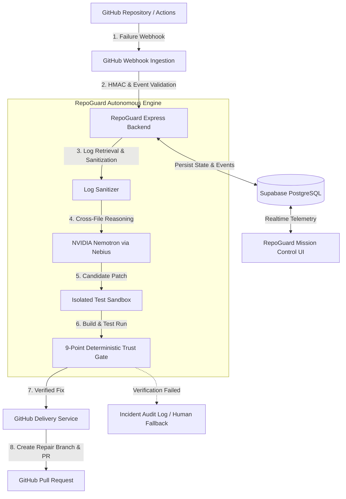

# RepoGuard — Autonomous Self-Healing CI/CD & Security Agent

> **From failing builds to working code. Automatically.**  
> RepoGuard is an autonomous, safety-gated AI agent system that detects CI/CD pipeline failures and security vulnerabilities, investigates root causes, generates verified patches in isolated sandboxes, and delivers pull requests with zero human intervention required until code review.

---

## 💡 Why RepoGuard?

### The Problem
Modern continuous integration and deployment (CI/CD) pipelines frequently break due to transient test flakiness, regression bugs, dependency mismatches, and security vulnerabilities. When a build fails, developers must manually:
1. Open and parse sprawling CI/CD build logs across multiple jobs.
2. Trace failure stack trace snippets back to specific source code commits.
3. Formulate hypotheses and edit relevant codebase files locally.
4. Run tests and verify that no secondary regressions were introduced.
5. Create a dedicated fix branch, push changes, and open a GitHub Pull Request.

This manual process interrupts developer flow, increases Mean Time To Resolution (MTTR), and consumes engineering cycles on repetitive debugging.

### The RepoGuard Solution
RepoGuard automates the end-to-end incident investigation and repair pipeline while enforcing strict deterministic safety gates between generative AI models and your production GitHub repositories. 

```
TRADITIONAL CI/CD DEBUGGING:
Developer receives failure ➔ Opens logs ➔ Searches repo ➔ Identifies bug ➔ Edits files ➔ Runs tests ➔ Pushes branch ➔ Opens PR

REPOGUARD AUTONOMOUS WORKFLOW:
Failure ➔ Webhook Ingestion ➔ Log Sanitization ➔ AI Cross-File Reasoning ➔ Sandbox Patching ➔ Isolated Testing ➔ Deterministic Verification ➔ Automated PR
```

> ⚠️ **Safety First**: AI is never given unrestricted write authority to your production repository. RepoGuard subjects every AI-generated patch to a 9-point deterministic verification gate before any git push or pull request creation occurs.

---

## 🔄 8-Stage Autonomous Pipeline

RepoGuard executes a deterministic 8-stage state machine for every CI/CD failure:

```
┌──────────┐     ┌──────────┐     ┌──────────┐     ┌──────────┐
│  DETECT  │ ──► │ INSPECT  │ ──► │  REASON  │ ──► │  PATCH   │
└──────────┘     └──────────┘     └──────────┘     └──────────┘
                                                        │
┌──────────┐     ┌──────────┐     ┌──────────┐          │
│ DELIVER  │ ◄── │  VERIFY  │ ◄── │   TEST   │ ◄────────┘
└──────────┘     └──────────┘     └──────────┘
```

1. **DETECT**: Ingests real-time `workflow_run` failure webhooks from GitHub Actions, verifies HMAC signatures using `SHA256`, validates the run status via GitHub REST API, and initializes an active repair incident.
2. **INSPECT**: Fetches failed job step logs, extracts stack traces and failure contexts, and sanitizes sensitive tokens, keys, and environment variables prior to AI model submission.
3. **REASON**: Inspects repository source trees at the exact failed commit SHA and leverages high-reasoning LLMs (such as NVIDIA Nemotron and DeepSeek-R1 via Nebius) to deduce the root cause and generate structured repair plans without exposing raw chain-of-thought.
4. **PATCH**: Generates targeted unified diff patches adhering to strict size limits, file path allowlists, and safety constraints.
5. **TEST**: Spawns an isolated execution sandbox, applies the candidate patch, and runs allowlisted build/test suites to verify the original failure is resolved without introducing regressions.
6. **VERIFY**: Passes candidate fixes through a 9-point deterministic trust gate (SHA consistency, file path authorization, patch application integrity, test suite pass-rate, side-effect checks, and incident consistency).
7. **DELIVER**: Checks remote HEAD status, creates a dedicated `repoguard/repair-*` branch via GitHub App RS256 JWT credentials, commits the verified patch, and opens a GitHub Pull Request with full audit metadata.
8. **HUMAN REVIEW**: Notifies maintainers with a complete audit trail, confidence metrics, and diff analysis. RepoGuard **never** auto-merges PRs to ensure human oversight.

---

## 🔒 Key Safety Principles & Gates

RepoGuard is engineered around a **Fail Closed** philosophy:

* **Fail Closed Safety**: If any stage (AI reasoning, patch syntax, sandbox execution, or verification gate) fails or returns low confidence, execution stops immediately and requests human review.
* **No Unrestricted Write Access**: AI outputs are parsed as structural code patches and validated in sandboxes; LLMs never execute shell commands directly on production systems.
* **Deterministic Verification Gate**: Every patch must satisfy 9 strict checks:
  1. Commit SHA alignment
  2. Authorized file boundaries
  3. Patch size constraints
  4. Clean patch application (`git apply`)
  5. Isolated build/test pass
  6. Original failure resolution
  7. Zero new regression failures
  8. Clean security scan (0 CVEs)
  9. Cross-context state consistency
* **Remote HEAD Guard**: Prior to branch push, RepoGuard verifies that the target branch HEAD matches the expected commit SHA to prevent race conditions or stale overwrites.
* **No Auto-Merge**: RepoGuard delivers complete Pull Requests with full test evidence, allowing team maintainers to perform final code reviews before merging.

---

## 🏗️ Architecture Diagram



---

## 🛠️ Technology Stack

* **Frontend**: React 19, TypeScript, Vite 8, Tailwind CSS, Framer Motion, Monaco Editor, Lucide Icons, Recharts.
* **Backend**: Node.js (tsx), Express 5, RS256 GitHub App JWT Authentication, GitHub Webhook HMAC Verification, Isolated Patch Test Runner.
* **AI Provider**: Nebius Token Factory (NVIDIA Nemotron 3 Ultra, DeepSeek-R1, Meta-Llama 3.1 8B).
* **Database & Telemetry**: Supabase PostgreSQL, Supabase Realtime subscriptions.

---

## 🚀 Getting Started

### Prerequisites
* Node.js v18+ 
* npm v9+

### 1. Clone & Install Dependencies
```bash
git clone https://github.com/pratyushwakde24-source/Repoguard.git
cd Repoguard
npm install
```

### 2. Configure Environment Variables
Copy `.env.example` to `.env` and fill in your credentials:
```bash
cp .env.example .env
```
Key required environment variables:
* `PORT`: Server port (default `3001`).
* `NEBIUS_API_KEY`: API key for Nebius Token Factory.
* `GITHUB_APP_ID`, `GITHUB_PRIVATE_KEY`, `GITHUB_WEBHOOK_SECRET`: GitHub App credentials for repository monitoring and PR delivery.
* `VITE_SUPABASE_URL`, `VITE_SUPABASE_ANON_KEY`: Supabase database connection details.

### 3. Run Development Servers
Start both the Express backend server and Vite frontend dev server:

```bash
# Terminal 1: Backend Server (runs on http://localhost:3001)
npm run server

# Terminal 2: Frontend Client (runs on http://localhost:5173)
npm run dev
```

### 4. Build & Verification Commands
```bash
# Code Quality Check
npm run lint

# Production Build Verification
npm run build
```

---

## 📄 License

This project is licensed under the MIT License - see the [LICENSE](LICENSE) file for details.
